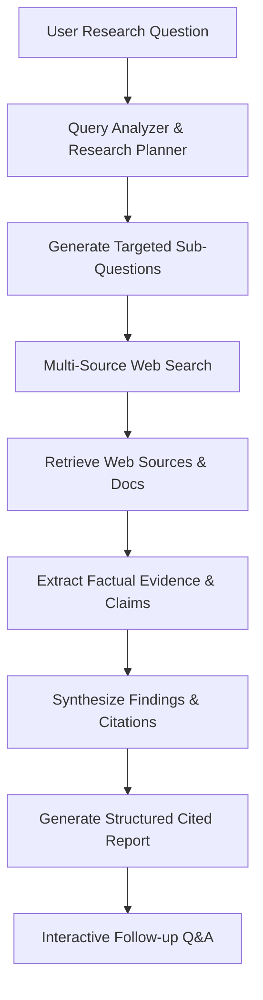

# PS-10: AI Research Assistant Agent

An autonomous multi-source AI research assistant built for college hackathons. The agent understands research questions, breaks them down into sub-questions, queries live web sources, extracts factual evidence, generates structured cited reports, and handles interactive follow-up Q&A.

---

## 🚀 Key Features

1. **Autonomous Research Planner**: Analyzes user questions and formulates targeted search sub-questions based on depth (*Quick*, *Standard*, *Deep*).
2. **Multi-Source Web Retrieval**: Queries live web sources via Tavily API with built-in multi-source search scrapers as fallback.
3. **Factual Evidence Extraction**: Extracts structured claims, supporting evidence quotes, source attributions, and confidence metrics (*High*, *Medium*, *Low*).
4. **Structured Cited Report Generation**: Produces cited reports with:
   - Executive Summary
   - Key Findings
   - Comparative Analysis Matrix (for comparison queries)
   - Extracted Evidence Table
   - Limitations & Disagreements
   - Conclusion
   - Clickable Source References `[1]`, `[2]`, `[3]`
5. **Interactive Source Viewer**: Slide-over modal displaying domain metrics, original URLs, agent relevance rationale, and extracted content.
6. **Follow-Up Q&A Engine**: Context-aware chat allowing users to ask follow-up questions, request simplifications, or trigger search expansions.
7. **Document Support**: Attach `.txt`, `.md`, or `.pdf` files to analyze uploaded documents alongside web research.
8. **Real-Time Agent Activity Trace**: Live progress feed displaying pipeline step statuses, analyzed source counts, and evidence metrics.

---

## 🛠 Tech Stack

- **Framework**: Next.js 15 (App Router, TypeScript)
- **UI & Styling**: React 19, Tailwind CSS v4, Lucide React icons
- **LLM Engine**: Google Gemini API (`gemini-2.5-flash` / `gemini-1.5-flash`) or OpenAI API (`gpt-4o-mini`)
- **Web Search API**: Tavily API + Built-in Multi-Source Scraper Fallback
- **Streaming**: Server-Sent Events (SSE) via Next.js API Routes

---

## 📥 Getting Started

### 1. Prerequisites
- Node.js `v18.0.0` or higher
- `npm` or `pnpm`

### 2. Installation
```bash
git clone <your-repo-url>
cd AiResearch
npm install
```

### 3. Environment Setup
Copy `.env.example` to `.env.local` and add your API keys:
```bash
cp .env.example .env.local
```

Edit `.env.local`:
```env
# Google Gemini API Key (Required for LLM reasoning & report synthesis)
GEMINI_API_KEY=your_gemini_api_key_here

# Tavily Search API Key (Recommended for web research)
TAVILY_API_KEY=your_tavily_api_key_here
```

*Note: If no Tavily key is supplied, the agent automatically utilizes built-in multi-source search fallback engines.*

### 4. Site link
Start the development server:


Open (https://research-l9k7kmtvv-arth21.vercel.app/) in your browser.

---

## 🔬 Core Agent Workflow



---

## 🧪 Demo Hackathon Query

Test the agent with this prompt:
> **"Compare the benefits, risks, and major applications of generative AI in education and software development."**

---

## 📄 License
MIT License
